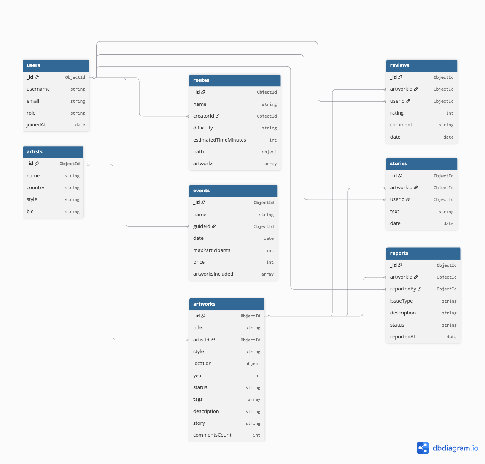

# UrbanCanvas


**UrbanCanvas** is a comprehensive information system and web application for tracking, reviewing, and mapping street art (murals, graffiti, and installations). The project was engineered as part of a NoSQL architecture university course.

---

## ER Diagram & Database Architecture

At the core of UrbanCanvas is a highly optimized NoSQL data model powered by **MongoDB**. The architecture employs 8 interconnected collections, leveraging references, `$jsonSchema` validation, and complex `$lookup` aggregations to build relationships.



### Core Collections:
- **`artists`** — Biographies, styles, and origins of street artists.
- **`artworks`** — The central entity containing rich details, tags, and **GeoJSON** points for mapping.
- **`routes`** — Curated city walking tours constructed with GeoJSON `LineString` paths.
- **`users`** — System actors (Tourists, Guides, System Admins).
- **`reviews`** & **`stories`** — User-generated content and lore tied to specific artworks.
- **`events`** & **`reports`** — Guided tours and moderation reports (e.g., vandalism tracking).

---

## Key Features

- **Geospatial Mapping:** Utilizes MongoDB's `2dsphere` indexes and Leaflet.js to render interactive dark-mode maps.
- **Complex Aggregations:** Uses deep pipelines (`$lookup`, `$unwind`, `$group`, `$addFields`) to calculate artist statistics and fetch relational graph data in a single query.
- **Strict Data Integrity:** Enforces schema rules directly at the DB level using BSON `$jsonSchema` validators.
- **Fully Containerized:** Zero local dependencies. The entire stack (DB + Next.js App) runs in isolated Docker containers.
- **Admin Control Room:** A dedicated Next.js graphical interface for full CRUD management.

---

## Quick Start (Docker)

No local Node.js or MongoDB installation is required. Everything runs via Docker Compose.

### 1. Launch the Stack
Fire up the MongoDB engine and the Next.js frontend in detached mode:
```bash
docker-compose up --build -d
```

### 2. Seed the Database
Populate the database with collections, `$jsonSchema` validators, `2dsphere` indexes, and realistic initial data:
```bash
docker exec urbancanvas-app node seed.js
```

### 3. Run Aggregation Tests
Execute advanced MongoDB queries (filtering, bulk updates, multi-stage lookups) via the CLI:
```bash
docker exec urbancanvas-app node test-queries.js
```

### 4. Explore the Web App
The Next.js client is now served and hot-reloading on port `3010`. Open your browser to explore the map and admin panel:

👉 **[http://localhost:3010](http://localhost:3010)**

---
*Built with ❤️ for the love of urban culture.*